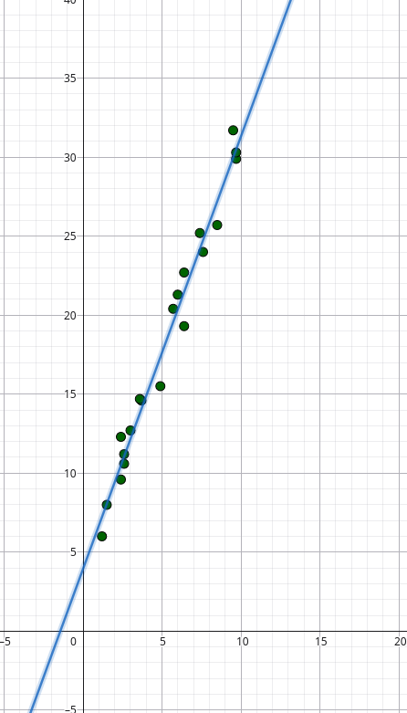

# Linear Regression

Implementação da Regressão Linear Simples em múltiplas linguagens de programação.

O objetivo deste projeto é estudar como diferentes linguagens expressam um mesmo algoritmo estatístico, comparando aspectos como legibilidade, paradigma de programação, sistema de tipos, modelagem matemática, desempenho e ergonomia de desenvolvimento.

Atualmente o projeto possui implementações em:

- Haskell
- Rust
- Java

## Objetivo

A regressão linear simples busca encontrar a reta que melhor descreve a relação entre duas variáveis numéricas.

O modelo possui a forma:

$$
y = \beta_{1}x + \beta_{0}
$$

onde:

- $\beta_{1}$ é o coeficiente angular (inclinação da reta);
- $\beta_{0}$ é o intercepto;
- $x$ é a variável independente;
- $y$ é a variável dependente.

Os coeficientes são calculados pelo método dos mínimos quadrados.

### Coeficiente Angular

$$
\beta_{1} = \frac{n \sum{xy} \sum{y}}{n \sum{x^2} - (\sum{x})^2}
$$

### Intercepto

$$
\beta_{0} = \frac{\sum{y} - \beta_{1} \sum{x}}{n}
$$

## Estrutura do Projeto

```text
linear-regression/
├── haskell/
│   ├── app/
│ 	│   └── Main.rs
│   └── src/
│       └── LinearRegression.hs
│
├── rust/
│   └── src/
│   	├── linear_regression.rs
│       └── main.rs
│
└── java/
    ├── app/
 	│   └── Main.java
    └── model/
        └── Coefs.java
```

Cada diretório contém uma implementação independente do algoritmo.

# Dados

Os regressores foram testados com um conjunto de dados bem simples:

x = `[6.0, 9.5, 7.6, 6.4, 2.4, 2.4, 1.5, 9.7, 6.4, 7.4, 1.2, 9.7, 8.5, 3.0, 2.6, 2.6, 3.7, 5.7, 4.9, 3.6]`
y = `[21.3, 31.7, 24.0, 22.7, 9.6, 12.3, 8.0, 29.9, 19.3, 25.2, 6.0, 30.3, 25.7, 12.7, 11.2, 10.6, 14.6, 20.4, 15.5, 14.7]`

para esse conjunto, a reta a ser encontrada é $y \approx 2.737765623364387 \cdot x + 3.9391081335706133$:



## Como Executar

### Haskell

requisitos:

- ghc
- stack

```bash
# clonar o repositório e entrar no workspace de haskell 
git clone https://github.com/0kauaa/linear-regression.git && cd linear-regression/haskell/

# compilar e executar
stack run
```

### Rust

requisitos:

- rustc
- cargo

```bash
# clonar o repositório e entrar no workspace de rust 
git clone https://github.com/0kauaa/linear-regression.git && cd linear-regression/rust/

# compilar executar
cargo run
```

### Java

requisitos:

- JDK >= 17
- javac
- java

```Shell
# clonar o repositório e entrar no workspace de java 
git clone https://github.com/0kauaa/linear-regression.git && cd linear-regression/java/

# compilar
mkdir -p out javac
javac -d out app/*.java model/*.java

# executar
java -cp out app.Main
```
